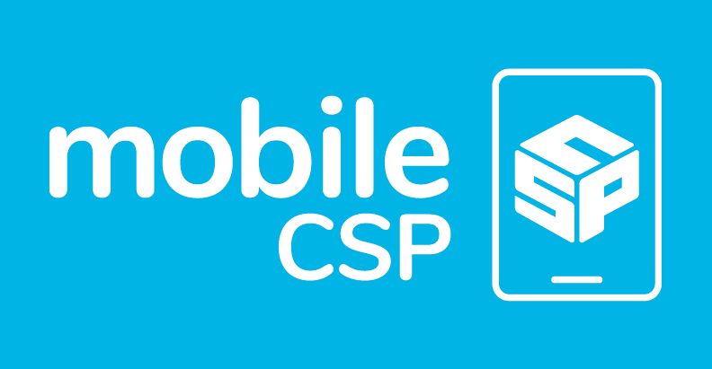

The Internet and the Cloud - Explore Curricular Activity
========================================================

.. raw:: html

    <!-- Custom Scripts -->
    
    
    <link href="../_static/assets/lib/lessons/tipped.css" rel="stylesheet" type="text/css"></link>
    <link href="../_static/assets/lib/lessons/lessons.css" rel="stylesheet" type="text/css"></link>
    <link href="../_static/assets/css/custom.css" rel="stylesheet" type="test/css"></link>
    
    

.. raw:: html

        

    
    <h3 id="est-length">Time Estimate: 45 minutes</h3>
    

Introduction
-------------

.. raw:: html

    

    
    Throughout this course, there is a focus on 3 key questions about the Internet; they are introduced here and revisited throughout the course:
    <ul>
    <li>What is the Internet, how is it built, and how does it work?</li>
    <li>What aspects of the Internet’s design and development have enabled it to grow so large and be so influential?</li>
    <li>How do the Internet and Cloud applications impact our society, positively and negatively? </li>
    </ul>
    
The Internet and the World Wide Web have had a tremendous influence
    on our world and our lives.  Yet, most people do not really understand what the Internet 
    is and how it works.   This lesson provides a high-level overview of some key concepts and clarifies the
      difference between the <i>Internet</i> and the <i>World Wide Web (WWW)</i>. Lessons
      later in the course will go into greater detail in explaining how the Internet works and explore cybersecurity.

    

Video: The Internet and World Wide Web
---------------------------------------

.. raw:: html

    

    
<a href="https://docs.google.com/document/d/1vCnh_0xrVIhhNW9ve6ngLeoNfzEVPCj8HleS_9dlPu0/edit" target="_blank">Guided Worksheet:</a> answer these questions as you watch the video 
    <a href="https://docs.google.com/presentation/d/1AxexCFAWMwo1qckAa2CK-_m-6Y62wBQtOhc4um_uhuU" target="_blank">Slides: Internet and WWW</a>

    
.. youtube:: ZHmW2zdsaTU
        :width: 650
        :height: 415
        :align: center
    
.. raw:: html
    
    
    <h3>Definitions</h3>
    
Many people do not realize that the  <i>Internet</i> and the <i>World Wide Web</i> are two 
    completely different things. The basic distinctions are:
    
    
<ul>
    <li>The <b><i>World Wide Web (WWW)</i></b> is an application that runs on the
        Internet.  The WWW is a system of interlinked resources -- documents, images, sounds,
        videos, data files -- that are stored on the Internet and can be accessed through a 
        <i>browser</i>.
      </li>
    <li>The <b><i>Internet</i></b>  is the underlying global network that supports
        the WWW and many other applications.  It consists of many different local networks that
        are connected together by various hardware devices.  
      </li>
    <li>The <b><i>Cloud</i></b> is just a popular term for the Internet and its applications used 
        largely in marketing and advertising. Facebook,  Google, Twitter, Dropbox are often referred to
        as <i><b>cloud applications</b></i>.  They could also be called Internet applications.  App 
        Inventor is another example of a cloud application. 
      </li>
    <li><i><b>Browsers</b></i>: are programs that display web pages and are used to navigate the WWW. Watch this quick, informative
    <a href="https://www.youtube.com/embed/BrXPcaRlBqo" target="_blank">video on browsers</a>.
    
    </li></ul>
    

    
    Here is a table of some of the technical vocabulary we've introduced in this lesson. Hover over the terms to review the definitions.
     
    

    <table align="center">
    <tbody><tr>
    <td>Internet
     World Wide Web (WWW)
     Browser
     Protocol
     TCP/IP
    </td>
    <td>
    HTTP
     Tim Berners-Lee
     WWW as a higher level of abstraction
     Open standard
     IETF
    </td>
    </tr>
    </tbody></table>
     
    

Explore Curricular Activity: Beneficial and Harmful Effects of Computing Innovations
-------------------------------------------------------------------------------------

.. raw:: html

    

    

    <h3>POGIL Activity for the Classroom (25 minutes)</h3>
    

    

This course emphasizes communication and collaboration. You will do many group activities called POGIL Activities in this course, starting with the one below.   <a href="https://pogil.org/about-pogil/what-is-pogil" target="_blank">POGIL</a> stands for Process Oriented Guided Inquiry Learning. In POGIL activities, you will work in self-managed teams of 3 or 4 students where everyone has a role. You will explore an activity or solve a problem together, making sure that everyone in the team participates and learns. In order for these POGIL activities to be effective, each member must be willing to practice good interpersonal skills including communication, consensus building, conflict resolution, and negotiation.

    
To get started, break into POGIL teams of 4 and assign each team member one of the following roles (click here for more information about these <a href="https://docs.google.com/document/d/1_NfNLWJxaG4qZ2Jd2x8UctDS05twn1h6p-o3XaAcRv0/edit?usp=sharing" target="_blank">POGIL roles</a>). 
      
      

    
<table>
    <tbody><tr><th>Role</th><th>Responsibility</th></tr>
    <tr>
    <td>Facilitator</td>
    <td>Reads the questions aloud, keeps track of time and makes sure everyone contributes appropriately and is heard.</td>
    </tr>
    <tr>
    <td>Spokesperson</td>
    <td>Talks to the instructor and other teams when the team has questions and reports team answers back to the class. </td>
    </tr>
    <tr>
    <td>Quality Control</td>
    <td>Records all answers and makes sure everyone agrees on the answers.</td>
    </tr>
    <tr>
    <td>Process Analyst</td>
    <td>Considers how the team could work and learn more effectively with respect to use of time, effectiveness, contributions. Reports back to team and class.</td>
    </tr>
    </tbody></table>
    
Do the following activities with your group. Click  <a href="https://docs.google.com/document/d/1R6u0geqIRmilERAgnlaRfo9Of5qyl0Z0w_35itx1_Qs/copy" target="_blank">here to make a copy of the worksheet for this POGIL activity.</a>
    
<ol>
    <li>What applications do you use throughout the day? In your group, make a list of 4-6 apps that you use on your phone or computer. 
        </li>
    <li>Classify these apps as 
          <ul>
    <li>Cloud Applications that happen in the browser, </li>
    <li>Or Cloud Applications that do not use the browser, </li>
    <li> Or Applications that do not require the Internet. </li>
    </ul>
    </li>
    <li>Put a star * next to any of the applications that can be classified as social media (apps and websites that let you create and share content or participate in social networking). 
    
        </li>
    <li>Changing Behaviors : As computing evolves, the way people complete tasks often changes to incorporate new computing innovations. Describe one task that is now done differently due to a social media app.</li>
    <li>
          Make a Venn Diagram (see <a href="https://docs.google.com/document/d/1R6u0geqIRmilERAgnlaRfo9Of5qyl0Z0w_35itx1_Qs/copy" target="_blank">worksheet</a> or below) to classify the effects of the Social Media apps as harmful or beneficial to society, culture, or economy. Keep in mind, a single effect can be viewed as beneficial to some people and harmful to others.</li>
    <li>Computing innovations can be used in ways that the creator had not originally intended. For example, the World Wide Web was originally intended only for sharing information within the scientific community, but it has grown into a vital part of our social and economic lives. The large number of users that use the WWW in different ways has resulted in significant impacts beyond its original purpose. The total effects of a social media app cannot always anticipated in advance. Discuss how some social media apps have had complex effects that were not anticipated. Describe one example of an effect of a social media app that was not originally anticipated.</li>
    <li>If you were a developer of one of the social media apps that you listed, how would you reduce its harmful effects?
     Responsible programmers try to consider the unintended ways their computing innovations can be used and the potential beneficial and harmful effects of these new uses, although it is not possible for a programmer to consider all the ways a computing innovation can be used. Rapid sharing of a program or running a program with a large number of users can result in significant impacts beyond the intended purpose or control of the programmer. Some of these impacts may be beneficial, for example leading to advances in other fields. Some of these impacts may be harmful, for example information placed online or on social media apps can be shared with unintended audiences, affecting our privacy -- an email message may be forwarded, tweets can be retweeted, and social media posts can be viewed by potential employers. 
    </li>
    </ol>
    
    <!-- 2017 worksheet &lt;a href=&quot;https://docs.google.com/document/d/1RfWIEITexC70kKufNXlWTaGL13gUT5CTl8Wah-HmdHY/edit&quot; target=&quot;_blank&quot;&gt;using this worksheet&lt;/a&gt; -->.  
      <!-- 2017 Questions 
    The Internet and WWW: Critical Thinking Questions
    List the brands of Internet browsers that members in your group use. Why might it be more accurate to call an Internet browser &quot;a WWW browser&quot;?
    Have each member of your group give an example of something you use the WWW for.
    What are some examples of applications that use the Internet, but not necessarily through a browser?
    (Portfolio) In your own words, give a sentence that would explain to a friend the difference between the WWW and the Internet.
    -->
    <!-- Embedded worksheet 2018? &lt;iframe width=100% height=500px scrolling=yes  style=&quot;border:0;&quot; src=&quot;https://docs.google.com/document/d/e/2PACX-1vSCTaQ2hYO25qAuCOAhdilqiFZ0F4LozaoxK3RH_EOK0OPH9-HJ4vZuOlSvo_CePuUv38A7d_-GMIul/pub&quot;&gt;&lt;/iframe&gt; -->
    <!-- 2016
    &lt;h3&gt;Video 2: Measuring the Internet&lt;/h3&gt;
    &lt;p&gt;
      (&lt;a target=&quot;_blank&quot; href=&quot;https://docs.google.com/presentation/d/1DqFTlGNYOy0gFP0ByPyLJ8jvVb1N_y_wuDLYVWenUJs&quot;&gt;Slides: Measuring Your Network&lt;/a&gt;)
    &lt;/p&gt;
    
    &lt;div class=&quot;pogil&quot;&gt;
      &lt;h3&gt;POGIL Activity for the Classroom (10 minutes)&lt;/h3&gt; 
      Using the same groups as the earlier activity, answer the following questions. 
      
      &lt;h4&gt;Measuring Your Network: Critical Thinking Questions&lt;/h4&gt;
      &lt;ol&gt;
        &lt;li&gt;When measuring bandwidth, would good performance be a large number or a small number?&lt;/li&gt;
        &lt;li&gt;When measuring latency, would good performance be a large number or a small number?&lt;/li&gt;
        &lt;li&gt;Use CNET’s bandwidth tool to measure bandwidth at your school and (later) at home).&lt;/li&gt;
        &lt;li&gt;Use this Ping tool to measure the average latency between the sites &lt;b&gt;http://google.com&lt;/b&gt; and &lt;b&gt;http://whitehouse.gov&lt;/b&gt;&lt;/li&gt;
        &lt;li&gt;Use Ookla’s Broadband map to explore bandwidth speeds in the US. 
          &lt;ol&gt;
            &lt;li&gt;Check for your school&#39;s location.&lt;/li&gt;
            &lt;li&gt;Which state in the US has the fastest average speed?&lt;/li&gt;
            &lt;li&gt;Which state has the slowest?&lt;/li&gt;
            &lt;li&gt;What is the difference between the fastest and slowest states?&lt;/li&gt;
          &lt;/ol&gt;
        &lt;li&gt;You can also compare bandwidth speeds between countries using Ookla’s global map.. 
          &lt;ol&gt;
            &lt;li&gt;Which country has the fastest average speed? &lt;/li&gt;
            &lt;li&gt;How does your country compare?&lt;/li&gt;
          &lt;/ol&gt;
      &lt;/ol&gt;
      
    &lt;/div&gt;
    
    -->
    <!-- 2017
    &lt;h2&gt;Activity: Computing Ethics&lt;/h2&gt;
    &lt;p&gt;
      Innovations in computing have raised legal and ethical concerns. From commercial access to music and movie downloads 
      and streaming and open source and licensing of software and content, how individuals use computers is 
      becoming more and more important.&lt;/p&gt;
    
    &lt;p&gt;According to the Computer Ethics Institute, here are the &lt;a href=&quot;http://computerethicsinstitute.org/publications/tencommandments.html&quot; target=&quot;blank&quot;&gt;Ten Commandments of Computer Ethics&lt;/a&gt;, describing ethical behavior when using computers:
      
      &lt;/p&gt;&lt;ol&gt;
        &lt;li&gt;You shall not use a computer to harm other people.
        &lt;/li&gt;&lt;li&gt;You shall not interfere with other people&#39;s computer work.
        &lt;/li&gt;&lt;li&gt;You shall not snoop around in other people&#39;s computer files.
        &lt;/li&gt;&lt;li&gt;You shall not use a computer to steal.
        &lt;/li&gt;&lt;li&gt;You shall not use a computer to bear false witness.
        &lt;/li&gt;&lt;li&gt;You shall not copy or use proprietary software for which you have not paid without permission.
        &lt;/li&gt;&lt;li&gt;You shall not use other people&#39;s computer resources without authorization or proper compensation.
        &lt;/li&gt;&lt;li&gt;You shall not appropriate other people&#39;s intellectual output.
        &lt;/li&gt;&lt;li&gt;You shall think about the social consequences of the program you are writing or the system you are designing.
        &lt;/li&gt;&lt;li&gt;You shall always use a computer in ways that ensure consideration and respect for your fellow humans.
    &lt;/li&gt;&lt;/ol&gt;
    
    
    &lt;div class=&quot;pogil yui-wk-div&quot;&gt;
      &lt;h3&gt;POGIL Activity for the Classroom (10 minutes)&lt;/h3&gt; 
      Using the same groups as the earlier activity, answer the following questions, recording your answers &lt;a href=&quot;https://docs.google.com/document/d/1iBxiiOSTEyzWuZRfSBXPkcstXMxU-DoFRryxsY0eCBU/&quot; target=&quot;_blank&quot; title=&quot;&quot;&gt;using this worksheet&lt;/a&gt;. 
    
      &lt;h4&gt;Computer Ethics: Critical Thinking Questions&lt;/h4&gt;
      As described in this &lt;a target=&quot;_blank&quot; href=&quot;https://www.scu.edu/ethics/focus-areas/internet-ethics/resources/apps-and-privacy/&quot;&gt;short case study&lt;/a&gt; a Silicon Valley social networking company was collecting users &quot;Contacts&quot; data and storing it on their servers.
      &lt;ol&gt;
        &lt;li&gt;According to the Commandments, was it unethical for the app developers to do so?  If so, which commandments did they
        violate?&lt;/li&gt;
        &lt;li&gt;(&lt;b&gt;Portfolio&lt;/b&gt;) As an app developer, what is your responsibility with regard to user data? Which commandments should serve as your
        guide on this point?&lt;/li&gt; 
      &lt;/ol&gt;
      
    &lt;/div&gt;
    -->
    

    

Summary
--------

.. raw:: html

    

    In this lesson, you learned how to:
      

    

    

Self-Check
-----------

.. raw:: html

    

    
Please note that you should login if you want your answers saved and scored. In addition, some of these exercises will not work in Internet Explorer or Edge browsers. We recommend using Chrome. 
    
.. mchoice:: repl-mcsp-2-6-1
    :random:
    :practice: T
    :answer_a: True
    :feedback_a: OK, so you didn’t get it right this time. Let’s look at this as an opportunity to learn. Try reviewing this; there is a common misconception that the Internet and the World Wide Web are the same, but they are not. The Internet is a network of networks and the World Wide Web is a system of interlinked hypertext documents that can be accessed on the Internet.
    :answer_b: False
    :feedback_b: That's right! There is a common misconception that the Internet and the World Wide Web are the same, but they are not. The Internet is a network of networks and the World Wide Web is a system of interlinked hypertext documents that can be accessed on the Internet.
    :correct: b

    True or False: The Internet and the World Wide Web are the same. 

.. raw:: html

    

    

    

    
.. mchoice:: repl-mcsp-2-6-2
    :random:
    :practice: T
    :answer_a: is a network of networks 
    :feedback_a: The Internet is a network of independent networks that connects devices and computers around the world. 
    :answer_b: was invented by Tim Berners-Lee
    :feedback_b: Mistakes are welcome here! Try reviewing this; the Internet was <b><i>not</i></b> invented by Tim Berners-Lee.  He invented the WWW.
    :answer_c: connects devices and computers around the world 
    :feedback_c: The Internet is a network of independent networks that connects devices and computers around the world. 
    :answer_d: is based on the Internet protocol suite
    :feedback_d: The Internet is based on the TCP/IP protocol.
    :correct: a,c,d

    The Internet _______________.    Choose all that apply. 

.. raw:: html

    

    

    

    
.. mchoice:: repl-mcsp-2-6-3
    :random:
    :practice: T
    :answer_a: is a system of interlinked hypertext documents 
    :feedback_a: Right.  Hypertext documents are those that follow the HypterText Transfer Protocol (HTTP).
    :answer_b: uses the HTTP protocol 
    :feedback_b: Yes, the HyperText Transfer Protocol (HTTP) controls the WWW. It was first proposed by Tim Berners-Lee.
    :answer_c:  is maintained by Google and Facebook 
    :feedback_c: Let me add new information to help you solve this question. The WWW is not maintained by any one company.  Its content is contributed by its billions of users throughout the world.
    :answer_d: was invented by Tim Berners-Lee 
    :feedback_d: Right.  Tim Berners-Lee is credited with inventing the WWW and making it a free and open resource.
    :correct: a,b,d

    The World Wide Web (WWW) _______________.   Choose all that apply. 

.. raw:: html

    

    

    

    
.. mchoice:: repl-mcsp-2-6-4
    :random:
    :practice: T
    :answer_a: Twitter
    :feedback_a: 
    :answer_b: Excel
    :feedback_b: Excel provided by Microsoft 360 is now cloud-based.
    :answer_c: G-mail
    :feedback_c: 
    :answer_d: PowerPoint
    :feedback_d: PowerPoint provided by Microsoft 360 is now cloud-based.
    :answer_e: Facebook
    :feedback_e: 
    :answer_f: Dropbox
    :feedback_f: 
    :correct: a,b,c,d,e,f

    Which of the following is an example of a cloud computing application? Choose all that apply. 

.. raw:: html

    

    

    

    
.. mchoice:: repl-mcsp-2-6-5
    :random:
    :practice: T
    :answer_a: a. Cloud computing relieves users from having to backup their own data and information. 
    :feedback_a: 
    :answer_b: b. Cloud computing makes it easier to share information.
    :feedback_b: 
    :answer_c: c. Information is stored on each user's computer. 
    :feedback_c: Try asking a classmate for advice—s/he may be able to explain/suggest some ideas or recommend some strategies.
    :answer_d: d. Users can access information that is on the cloud from anywhere that has an Internet connection. 
    :feedback_d: 
    :correct: a,b,d

    Which of the following are advantages of cloud computing? Choose all that apply.

.. raw:: html

    

    

    

    

    

Still Curious?
---------------

.. raw:: html

    

    
There is a wealth of good introductory information about the Internet and the WWW.

    <ul>
    <li>Here are some fun videos about <a href="https://www.youtube.com/watch?v=Dxcc6ycZ73M" target="_blank">What is the Internet (3.5 mins)</a>, <a href="https://www.youtube.com/watch?v=h8K49dD52WA" target="_blank">history of the Internet (3.5 mins)</a>, and <a href="https://www.youtube.com/watch?v=Bkd3VyQMBK0&amp;noredirect=1" target="_blank">Tim Berners-Lee (4 mins)</a>.</li>
    <li>Wikipedia pages on the <a href="http://en.wikipedia.org/wiki/Internet" target="_blank">Internet</a> 
    and <a href="http://en.wikipedia.org/wiki/WWW" target="_blank">WWW</a> and the <a href="http://netforbeginners.about.com/od/i/f/What-Is-The-Internet.htm" target="_blank">
    difference between the Internet and WWW</a>.</li>
    </ul>
    

    

Reflection: For Your Portfolio
-------------------------------

.. raw:: html

    

    
Answer the following portfolio reflection questions as directed by your instructor. Questions are also available in this <a href="https://docs.google.com/document/d/1o7GSa0Js3jOrpVFZZQte5oKnX3QKRqOHoBVZSRrLeHA/edit?usp=sharing" target="_blank">Google Doc</a> where you may use File/Make a Copy to make your own editable copy.

    
<iframe class="portfolioQuestions" scrolling="yes" src="https://docs.google.com/document/d/e/2PACX-1vSxY7YyxX3a9B7IyXAzOQ0zc6JosVK5Hy_77i4BZze-bPibF9bSJsSoTEz_AXMAKsJfvydaKp5gwN7J/pub?embedded=true" style="height:30em;width:100%"></iframe>

    <!-- &lt;p&gt;Create a page on your portfolio named &lt;i&gt;The Internet and the Cloud&lt;/i&gt;  in your portfolio and put in the final answers your group arrived at for the POGIL questions.  Also, provide your own answer to the third question.&lt;/p&gt;
      &lt;ol&gt;
        &lt;li&gt;(&lt;b&gt;POGIL&lt;/b&gt;) In your own words, give a sentence that would explain to a friend the difference between the WWW and the Internet.&lt;/li&gt;
        &lt;li&gt;(&lt;b&gt;POGIL&lt;/b&gt;) As an app developer, what is your responsibility with regard to user data? Which commandments should serve as your guide on this point?&lt;/li&gt;
        &lt;li&gt;Give an example of a violation of Computer Ethics Commandment 10 -- i.e., describe a consequence of an app that would be disrespectful of someone.&lt;/li&gt;
      &lt;/ol&gt;-->
    

    
